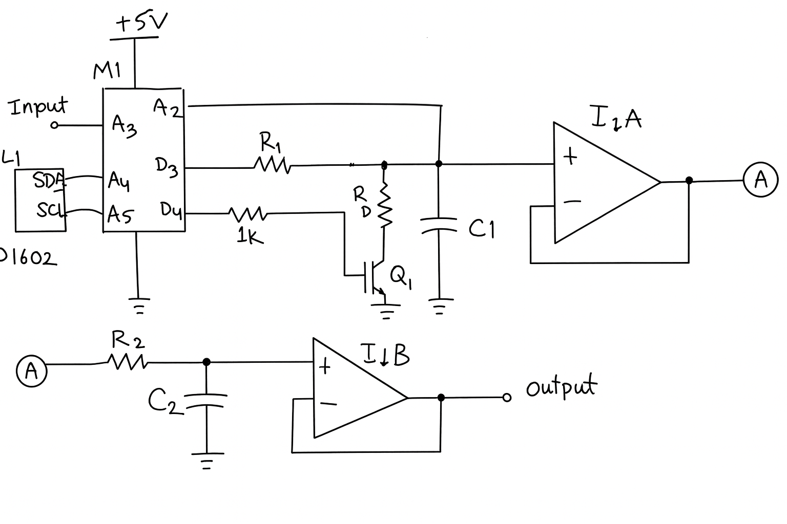

# ServoDAC

**ServoDAC** is a digitally controlled, closed-loop DAC implemented using a microcontroller GPIO pin, an RC storage capacitor, and firmware-controlled charge/discharge pulses.

Instead of relying on PWM averaging or resistor ladders, ServoDAC directly **controls the charge on a capacitor** and continuously corrects it using feedback — much like a servo system.

The result is a stable, low-noise analog voltage with predictable dynamics and no PWM carrier ripple.

---

## Concept Overview

Traditional MCU DAC approaches include:

- PWM + RC filtering (carrier ripple, duty-cycle–dependent dynamics)
- R-2R ladders (component tolerance, pin count)
- External DAC ICs (cost, availability, interface complexity)

ServoDAC takes a different approach:

1. Charge a capacitor for a precisely calculated time
2. Discharge it when necessary using a controlled reset path
3. Measure the actual voltage on the capacitor
4. Correct the error every control cycle

This makes the DAC **self-correcting**, insensitive to leakage, and largely independent of component tolerances.

---

## Example: Input Follower

Software requirements:
- LiquidCrystal_I2C version 2.0.0 or above.

Refer to [examples/input_follower](examples/input_follower/input_follower.ino).

Here, the sketch is responsible for the analog input pin, the LCD, and invoking the ServoDAC refresh cycle. 

The ServoDAC library handles the charge, discharge, and feedback pins.

Pin assignments can be changed. The feedback pin must be an analog input pin.

### Core Elements

- **Microcontroller** (Arduino Nano V3)
- **Storage capacitor (C1)** holding the analog voltage
- **Charge resistor (R1)** limiting current from GPIO
- **MOSFET discharge path (Q1 + R_D)** for controlled reset
- **Op-amp buffer (I1A)** isolating C1 from load and ADC
- **Single-pole post-filter (R2/C2)** removing residual spikes
- **Second op-amp buffer (I1B)** driving the final output

The MCU closes the loop by sampling the voltage on C1 and adjusting charge/discharge pulse widths accordingly.

---

## Closed-Loop Operation

Every control cycle (~10 ms):

1. Read **target voltage** (e.g. potentiometer on A3)
2. Read **actual voltage** at C1 (feedback on A2)
3. Compute the error
4. If error exceeds deadband:
   - Apply a **charge pulse** (D3 → R1 → C1), or
   - Apply a **discharge pulse** (D4 → Q1 → R_D)
5. Repeat

Pulse widths are calculated using the **RC exponential equations**, so each correction corresponds directly to the required voltage change.

The system behaves like a servo, not a PWM filter.

---

### Components

- **M1**: Arduino (Nano V3, Uno)
- **I1**: LMC6482 (dual rail-to-rail op-amp, ultra-low input bias) [1]
- **Q1**: 2N7000 N-MOSFET
- **R1**: 2.2kΩ (charge resistor)
- **C1**: 470nF film (Mylar or PP)  
- **R_D**: 1kΩ (discharge resistor)
- **R2**: 10kΩ (post-filter)
- **C2**: 100nF (post-filter)
- **L1**: LCD1602 with I²C backpack

[1] If not using an ultra-low input bias op-amp, to account for any leakage current, call dac.update(v) periodically to send a compensating dose of charge to the capacitor.

### Key Connections

- **D3** → R1 → C1 node (charge)
- **D4** → gate resistor → Q1 gate (discharge)
- **A2** → C1 node (feedback)
- **A3** → target input
- **A4 / A5** → LCD1602 (I²C)

## Why This Works Well

- No PWM carrier ripple
- Output defined by **physics + feedback**, not duty cycle
- Leakage and drift are automatically corrected
- Analog performance improves with better op-amp choice
- Filter requirements are minimal (1-pole is sufficient)

## Limitations & Tradeoffs

- Update rate limited by control loop timing
- Step response intentionally smoothed
- Not suitable for high-frequency waveform generation
- Requires careful grounding and op-amp choice

ServoDAC is ideal for **slow, precise analog control**, not audio DACs or waveform synthesis.

---

## Naming Rationale

The name **ServoDAC** reflects the core idea:

> The output voltage is actively servoed to the target value.

This is not PWM filtering — it is closed-loop analog control.

---

## Examples

ServoDAC includes several example sketches under the `examples/` directory. Each example is self-contained and demonstrates a specific usage pattern.

### [`spec`](examples/spec)

**Purpose:**  
Manual, specification-style control of the output voltage.

**Description:**  
Reads a voltage value from the Serial console and servos the DAC output to that value. Intended for manual testing, calibration, and characterization.

**Usage:**
- Open the Serial Monitor at **115200 baud**
- Enter a voltage (e.g. `1.25`) and press Enter
- Output is clamped to **0.0–5.0 V**

**Key features:**
- Serial-controlled target voltage
- Uses `Serial.parseFloat()` (AVR-safe)
- LCD display of target, measured voltage, pulse width, and error

---

### [`input_follower`](examples/input_follower)

**Purpose:**  
Demonstrates closed-loop following of an analog input.

**Description:**  
Reads an input voltage (e.g. from a potentiometer) and drives the ServoDAC output to follow it smoothly using the feedback loop. This is the simplest “turn-the-knob, see-the-voltage” demonstration.

**Key features:**
- Continuous analog tracking
- LCD readout of target, measured voltage, pulse width, and error
- Good starting point for understanding ServoDAC behavior

---

### [`sinewave_spec`](examples/sinewave_spec)

**Purpose:**  
Demonstrates dynamic waveform generation.

**Description:**  
Generates a sine wave in software and servos the DAC output to that waveform. Useful for evaluating dynamic response, settling behavior, and loop stability.

The frequency is read from the serial monitor.

**Key features:**
- Software-generated sine wave
- Periodic target updates
- LCD monitoring of output and error

---

## [sinewave](examples/sinewave)

Like sinewave_spec, except the input is read from a voltage divider on pin A3.

---

### Notes

- All examples assume the same basic RC DAC hardware and pin assignments.
- Each example folder contains its own `README.md` with wiring and usage notes.
- Examples are compiled and uploaded independently.
