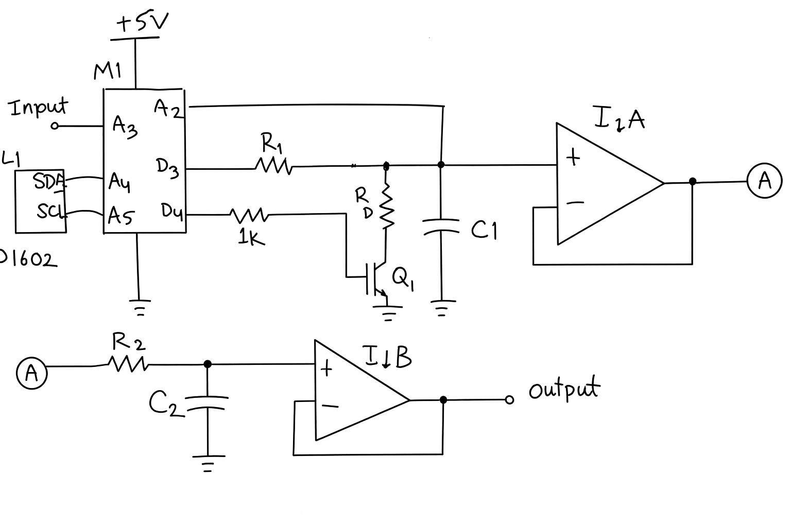

# ServoDAC

ServoDAC is a feedback-controlled analog voltage generator built from an RC integrator, two digital pins, and an ADC measurement.

Instead of producing an analog voltage using PWM filtering or an R-2R ladder, ServoDAC uses a **closed-loop control system**. The microcontroller measures the capacitor voltage and applies precisely timed charge or discharge pulses until the output matches the requested target voltage.

The result is a **true analog output with predictable dynamics**, no continuous PWM carrier ripple, and automatic correction for component tolerances and drift.

ServoDAC is intended for **slow, precise analog control signals**, not high-frequency waveform generation.

---
## The Electronics



### Components

- **M1**: Arduino (Nano V3, Uno)
- **I1**: LMC6482 (dual rail-to-rail op-amp, ultra-low input bias) [1]
- **Q1**: 2N7000 N-MOSFET
- **R1**: 2.2kΩ (charge resistor)
- **C1**: 470nF film (Mylar or PP)  
- **R_D**: 2.2kΩ (discharge resistor)
- **R2**: 10kΩ (post-filter)
- **C2**: 100nF (post-filter)
- **L1**: LCD1602 with I²C backpack, optional but used in some examples

[1] If not using an ultra-low input bias op-amp, to account for any leakage current, call dac.update(v) periodically to send a compensating dose of charge to the capacitor.

### Key Connections

- **D3** → R1 → C1 node (charge)
- **D4** → gate resistor → Q1 gate (discharge)
- **A2** → C1 node (feedback)
- **A3** → target input
- **A4 / A5** → LCD1602 (I²C)
- 
---

# Quick Start

1. Build the circuit shown in `schematic.png`.
2. Install this library in your Arduino libraries folder.
3. Install `LiquidCrystal_I2C` if you want to run the LCD examples.
4. Open and upload: [examples/input_follower](examples/input_follower)

5. Connect a potentiometer to **A3**.

The ServoDAC output will follow the potentiometer voltage.

---

# How It Works

ServoDAC treats the RC network as a controllable analog plant.

The microcontroller:

1. Measures the capacitor voltage using the ADC.
2. Compares it to a requested target voltage.
3. Computes how long to apply either a **charge** or **discharge** pulse.
4. Applies the pulse and repeats.

Because the RC charging behavior follows a known exponential equation, the software can estimate the pulse duration needed to move the capacitor toward the target voltage. The feedback loop then corrects any residual error.

This makes the output voltage largely independent of:

- resistor tolerance
- capacitor tolerance
- leakage
- temperature drift

The feedback loop continuously trims the voltage to maintain the target value.

Unlike PWM DAC methods, ServoDAC does not produce a continuous switching carrier. The output only receives **brief correction pulses** when the controller adjusts the capacitor voltage.

---

# Hardware

The core circuit consists of:

- RC integrator
- discharge path
- op-amp buffer
- ADC feedback

Typical component values:
```
R1 = 2.2 kΩ
C1 = 470 nF
RD = 2.2 kΩ
```

Only the **RC time constant** is important for system dynamics.

The op-amp buffers the capacitor node so the output voltage can drive external loads without disturbing the integrator.

A **low input-bias op-amp** is recommended. The reference design uses: `LMC6482`


Higher input bias currents increase leakage and require the control loop to compensate more frequently.

---

# Performance Expectations

ServoDAC is designed for **slow analog control signals** such as:

- bias voltages
- actuator control
- reference voltages
- waveform generation at low frequencies

Performance depends primarily on:

- RC time constant
- ADC speed
- control loop update rate
- pulse timing resolution

Typical characteristics with the example values:

- control update interval: ~2 ms
- RC time constant: ~1 ms
- stable output bandwidth: tens of Hz

ServoDAC is **not intended for high-frequency waveform synthesis** or audio DAC applications.

---

# Examples

The repository includes several example sketches.

## input_follower

Reads an input voltage from **A3** and drives the ServoDAC output to match it.

Useful for verifying hardware and observing the control loop behavior.

---

## spec

Reads the voltage from the serial console.

---

## sinewave

Generates a sine wave output using the ServoDAC.

Frequency is set via the input voltage on **A3**.

---

## sinewave_spec

Generates a sine wave. The frequency is set via the serial console.

---

# Library Overview

Main class: `ServoDAC`

Typical usage:
```
ServoDAC dac(pin_charge, pin_discharge, pin_feedback, R1, C1, RD);

dac.begin();
dac.update(target_voltage);
```

Each call to `update()` performs one control step:

1. Measure output voltage
2. Compute error
3. Apply charge or discharge pulse
4. Return measurement data

---

# Why Use ServoDAC?

ServoDAC is useful when you want:

- a **true analog voltage**
- no PWM ripple
- minimal external components
- automatic correction of analog component tolerances

It is especially attractive on microcontrollers that lack a hardware DAC.

---

# Limitations

ServoDAC is not suitable for:

- high-frequency waveforms
- audio DAC applications
- situations requiring high update bandwidth

The achievable response speed is fundamentally limited by the RC time constant and the control loop rate.

---

# License

MIT License


